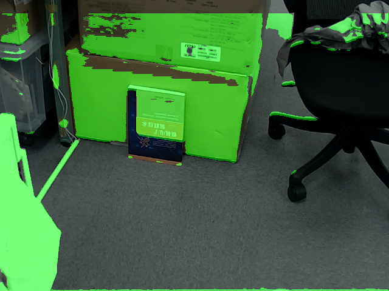

# workspace_segmentation
highlight working space without root(road space)


# used dataset 
**corridor floor segmentation**

https://www.kaggle.com/datasets/deepakmedam/corridor-floor-segmentation

 - If you need you can replace or merge your datasets
 - If you extract corridor dataset you find BlendedData and ground_truth directory

1. datasets annotation script(E.g. Using corridor dataset)

```
python flooranote.py

```

2. training

- after annotation, annotations directory is created with indivisual json files.
- training script is refferred to the annotation and BlendedData directories.

```
python floor_train.py

```

3. Inference
- Coloring non-floor objects.
- It is primitive version. So, I will add accuracy and useful function for factory working.

```
python cap_floor.py

```
# Requirement

```
# pip

json
torch
torchvision
Pillow
tqdm


```

# Sample




